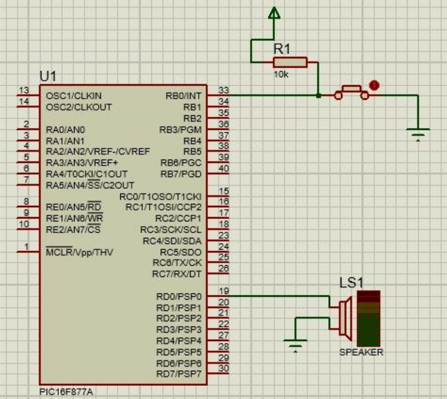
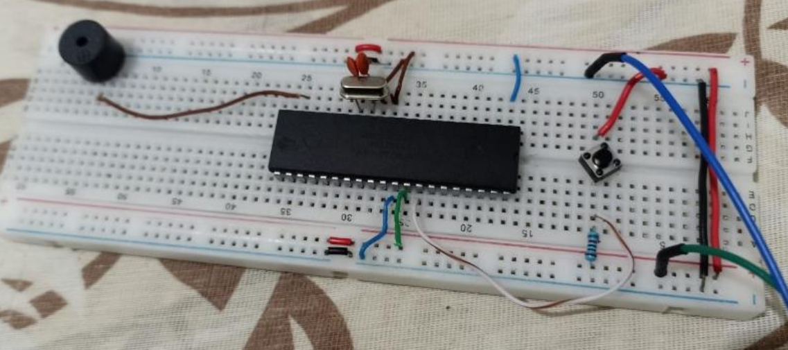

# 🎵 Práctica 10: Generador de Melodías - PIC16F877A

## 📋 Descripción

Este proyecto implementa un generador de melodías utilizando el microcontrolador **PIC16F877A**. El programa reproduce una melodía completa dividida en tres partes, y permite cambiar a una segunda melodía ("Let It Be" de The Beatles) mediante una interrupción externa activada por un pulsador.

### 🎯 Funcionalidad

- **PORTB** (bit 0): Configurado como entrada para el pulsador de interrupción (RB0/INT)
- **PORTD** (bit 0): Configurado como salida para el altavoz/buzzer (RD0)
- **Operación:** Reproducción de melodías musicales con notas de la séptima octava
- **Interrupción:** Cambio de melodía mediante pulsador en RB0

### 🔄 Funcionamiento

El programa implementa un reproductor de melodías con las siguientes características:

1. **Melodía Principal:** Se reproduce automáticamente al iniciar el programa
   - **Parte 1:** Se ejecuta dos veces (marcas de tiempo 0:24 y 0:36)
   - **Parte 2:** Se ejecuta una vez (marca de tiempo 0:50)
   - **Parte 3:** Se ejecuta una vez al final

2. **Melodía Secundaria (Let It Be):** Se activa mediante interrupción externa
   - Se reproduce cuando se presiona el pulsador en RB0
   - Interrumpe la melodía principal
   - Se ejecuta completamente antes de regresar

**Características:**
- Generación de tonos mediante alternancia rápida del pin del altavoz
- Frecuencias precisas para notas de la séptima octava (2kHz - 4kHz)
- Control de duración de notas mediante retardos programados
- Sistema de interrupción para cambio dinámico de melodía

## 🔧 Tecnologías Utilizadas


## 🛠️ Materiales Necesarios

### Herramientas y Software

- 💻 **MPLAB X IDE** o **MPLAB IDE**
- 🔧 **Compilador XC8** o **MPASM**
- 📡 **Programador PIC** (PICKit, ICD, etc.)
- 🔌 **Proteus ISIS** o **Proteus Professional** (para simulación)
- 📐 **Protoboard** o **PCB** para montaje
- 🔨 **Soldador** (si se usa PCB)

## 📁 Estructura del Proyecto

```
practica(10)/
├── README.md                    # Este archivo
├── prac10.X/
│   ├── prac10.asm              # Código fuente en ensamblador
│   └── NotasMusicales.inc      # Librería de notas musicales y retardos
└── dist/
    └── default/
        └── production/
            └── prac10.X.production.hex  # Archivo HEX para programar
```

## 💻 Código

El código está escrito en **ensamblador PIC** y está completamente comentado línea por línea para facilitar su comprensión.

### Características del Código

- ✅ Configuración de puertos (PORTB como entrada parcial, PORTD como salida)
- ✅ Manejo de bancos de memoria del PIC
- ✅ Interrupción externa por RB0/INT para cambio de melodía
- ✅ Rutina de servicio de interrupción (ISR) para melodía secundaria
- ✅ Generación de tonos mediante alternancia rápida del pin
- ✅ Control preciso de frecuencias para notas musicales
- ✅ Subrutinas modulares para cada parte de la melodía
- ✅ Sistema de retardos integrado con generación de tono
- ✅ Comentarios descriptivos en cada línea

### Algoritmo de Generación de Tono

El programa genera tonos mediante un generador de onda cuadrada:

```assembly
Tone_Gen:
  BTG PORTD, 0        // Alterna el pin del altavoz
  // Bucle de retardo para controlar la frecuencia
  // Cada medio período se genera con precisión
```

**Frecuencias de Notas (Octava 7):**
- Do (C7): ~2093 Hz
- Re (D7): ~2349 Hz
- Mi (E7): ~2637 Hz
- Fa (F7): ~2794 Hz
- Sol (G7): ~3136 Hz
- La (A7): ~3520 Hz
- Si (B7): ~3951 Hz

## 🚀 Instalación y Uso

### 1. Clonar el Repositorio

```bash
git clone https://github.com/LuisMatla/musica.git
cd musica
```

### 2. Abrir en MPLAB X

1. Abre **MPLAB X IDE**
2. File → Open Project
3. Selecciona el proyecto `prac10.X` o importa el proyecto

### 3. Compilar el Proyecto

1. Build → Build Main Project (F11)
2. Verifica que no haya errores en la compilación
3. El archivo `.hex` se generará en `dist/default/production/`

### 4. Programar el PIC

1. Conecta tu programador PIC al microcontrolador
2. Tools → Select Tool → [Tu Programador]
3. Production → Build and Program Main Project
4. Espera a que termine la programación

### 5. Simular en Proteus (Opcional)

1. Abre el proyecto en **Proteus ISIS**
2. Ejecuta la simulación
3. Prueba presionando el pulsador y observa la reproducción de melodías

## 🔧 Configuración del Hardware

### Conexiones PORTB (Pulsador)

```
PORTB.0 (RB0) → Pulsador → GND (con resistencia pull-up 10kΩ a VCC)
```

**Nota:** El pulsador activa la interrupción externa para cambiar a la melodía "Let It Be".

### Conexiones PORTD (Altavoz)

```
PORTD.0 (RD0) → Altavoz/Buzzer → GND
```

**Configuración Recomendada:**
- **Buzzer Piezoeléctrico:** Conectar directamente a RD0 y GND
- **Altavoz (8Ω):** Usar transistor NPN (2N2222) como amplificador:
  - Base del transistor → RD0 (con resistencia 1kΩ)
  - Colector del transistor → Altavoz → VCC
  - Emisor del transistor → GND

### Alimentación

```
VDD (Pin 11, 32) → +5V
VSS (Pin 12, 31) → GND
```

### Oscilador

```
OSC1 (Pin 13) → Cristal 4MHz
OSC2 (Pin 14) → Cristal 4MHz
Capacitores 22pF desde cada pin a GND
```

### Configuración de Fusibles

El programa configura los siguientes fusibles:

- **WDT:** Deshabilitado (Watchdog Timer OFF)
- **PWRTE:** Habilitado (Power-up Timer ON)
- **OSC:** Oscilador XT (Cristal)
- **LVP:** Deshabilitado (Low Voltage Programming OFF)
- **CP:** Deshabilitado (Code Protection OFF)

## 🖥️ Simulación del Circuito

A continuación se muestra el circuito simulado en **Proteus ISIS**:



**Descripción del Circuito Simulado:**

El circuito muestra el microcontrolador **PIC16F877A** conectado a:

- **Pulsador:** Conectado a RB0 con resistencia pull-up de 10kΩ para activar la interrupción externa.

- **Altavoz/Buzzer:** Conectado a RD0 del PIC para reproducir las melodías.

**Componentes del Circuito:**
- Microcontrolador PIC16F877A (U1)
- Pulsador con resistencia pull-up de 10kΩ
- Altavoz o buzzer piezoeléctrico
- Cristal oscilador 4MHz con capacitores
- Alimentación VCC (+5V) y GND

**Funcionamiento:**
- El sistema reproduce la melodía principal automáticamente
- Al presionar el pulsador, se activa la interrupción y se reproduce "Let It Be"
- Las notas se generan mediante alternancia rápida del pin RD0

## ✅ Sistema Funcionando

A continuación se muestra el circuito físico montado en protoboard y funcionando correctamente:



**Descripción del Sistema Físico:**

El circuito está montado en una protoboard y muestra:

- **Microcontrolador PIC16F877A:** Montado en el centro de la protoboard con sus 40 pines conectados correctamente.

- **Cristal Oscilador 4MHz:** Conectado a los pines 13 y 14 del PIC, con dos capacitores cerámicos de 22pF conectados a tierra.

- **Pulsador:** Conectado a RB0 con resistencia pull-up para activar la interrupción.

- **Altavoz/Buzzer:** Conectado a RD0 del PIC para reproducir las melodías.

- **Conexiones de Alimentación:** Cables rojo y negro conectados a los rieles de alimentación de la protoboard (+5V y GND).

**Estado del Sistema:**
El sistema está funcionando correctamente, reproduciendo la melodía principal y permitiendo el cambio a "Let It Be" mediante el pulsador.

## 📊 Estructura de las Melodías

### Melodía Principal

**Parte 1 (Repetida 2 veces):**
- Secuencia de notas: Mi → La → Si → Do → Re → Si → Do → La → ...
- Duración variable según la nota (100ms, 200ms, 600ms)
- Marca de tiempo: 0:24 y 0:36

**Parte 2:**
- Secuencia de notas: La → Sol bemol → La → Si → Mi → Re bemol → ...
- Duración: 170ms por nota
- Marca de tiempo: 0:50

**Parte 3:**
- Secuencia de notas: Mi → Re → Do → Si → Do → Re → Mi → ...
- Duración variable (50ms, 100ms, 170ms, 200ms, 600ms)
- Final de la melodía

### Melodía Secundaria (Let It Be - The Beatles)

**Características:**
- Se activa mediante interrupción externa (RB0)
- Secuencia de notas: Sol → Sol → Sol → La → Mi → Sol → ...
- Duración: 170ms y 200ms por nota
- Se reproduce completamente antes de regresar

## 🧪 Pruebas

### Prueba Básica

1. ✅ Alimenta el circuito con 5V
2. ✅ Verifica que la melodía principal se reproduzca automáticamente
3. ✅ Presiona el pulsador (RB0) y verifica que se reproduzca "Let It Be"
4. ✅ Verifica que después de "Let It Be" el sistema regrese al estado inicial

### Ejemplo de Prueba

- **Inicio:** La melodía principal comienza a reproducirse automáticamente
- **Parte 1:** Se ejecuta dos veces con las notas correspondientes
- **Parte 2:** Se ejecuta una vez
- **Parte 3:** Se ejecuta al final
- **Interrupción:** Si se presiona RB0, se reproduce "Let It Be" completamente
- **Final:** El programa termina en un bucle infinito

## 📝 Notas Técnicas

- El programa utiliza una **interrupción externa** por RB0/INT para cambiar de melodía
- Se implementa un **generador de tono** mediante alternancia rápida del pin PORTD, RD0
- El código maneja correctamente los **bancos de memoria** del PIC16F877A
- La configuración de puertos se realiza en el **banco 1** (TRISB, TRISD, OPTION_REG)
- Las operaciones de lectura/escritura se realizan en el **banco 0** (PORTB, PORTD, INTCON)
- Se utiliza el archivo **NotasMusicales.inc** para las definiciones de notas y retardos
- Las frecuencias se generan mediante bucles de retardo precisos
- El generador de tono `Tone_Gen` alterna el pin del altavoz para crear ondas cuadradas
- Las rutinas de retardo mantienen la frecuencia llamando repetidamente a `Tone_Gen`
- El sistema está optimizado para un cristal de 4MHz (Tcy = 1µs)

## 👨‍💻 Autores

**Luis Fernando Contreras Matla.**

**Samuel Obed García Velandia.**

## 📚 Información Académica

Esta práctica fue desarrollada como parte de la Experiencia Educativa:

- **Materia:** Microprocesadores y Microcontroladores
- **Universidad:** Universidad Veracruzana
- **Facultad:** Ingeniería Eléctrica y Electrónica
- **Docente:** Rosa María Woo García

## 📄 Licencia

Este proyecto es de uso educativo y académico.
